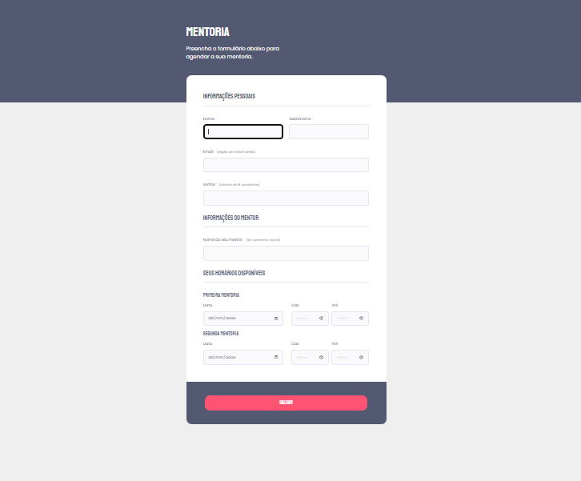

# Formulário intermediário

> Trilha Explorer
One more Rocketseat challenge has been done, this time an amazing form \o/

Nesse desafio da Rocketseat, foi nos dado o layout desse formulário pelo figma, para que replicassemos o mais igual possível. E esse foi o resultado hehe, eu aproveitei e o deixei responsivo, deu para treinar bastante codando. 

[🔗 Clique aqui para acessar](https://filipesantos07.github.io/Rocketseat-desafio-formulario-intermediario/)

## 🛠️ Tecnologias

- HTML
- CSS
- JavaScript

## 💛 Contato

FilipeSantosEstudos1@gmail.com